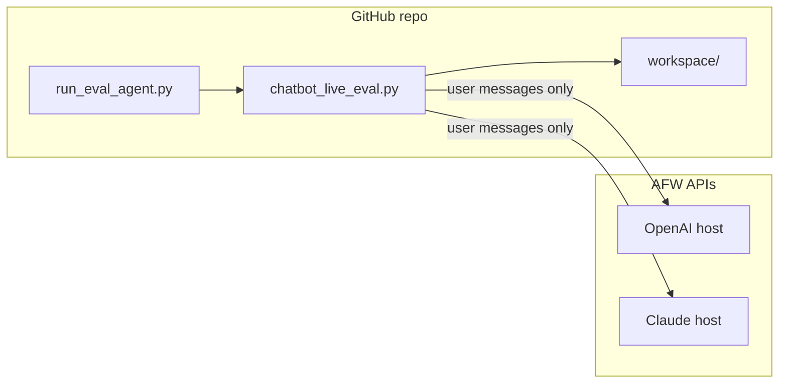

# AFW Chatbot Evaluation Agent

**Plug-and-play handoff package** for running live screening evaluations against Angel Flight West (AFW) chatbot APIs, scoring accuracy against gold labels, generating failure/prompt reports, and comparing two model runs with **McNemar's test**.

Built for the **UCLA Anderson Demand Management practicum** (New Horizons / UCD partnership). **This GitHub repo is the single source of truth** — agent code, test cases, predictions, transcripts, reports, and McNemar comparisons all live here under `workspace/`.

---

## Who should use this?

| Role | Typical use |
|------|-------------|
| **Product / ops** | Run a new eval after a prompt or model change; read accuracy + failure reports |
| **Data / BI** | Use `workspace/powerbi_export/` and per-run CSVs |
| **Engineering** | Verify API behavior; tune prompts using REMOVE/ADD recommendations |

No Azure deployment knowledge is required for the default workflow — only Python, network access to AFW endpoints, and a test-case Excel file.

---

## 5-minute quick start

### 1. Clone this repo

```powershell
git clone https://github.com/shprasa/afw-chatbot-eval-agent.git
cd afw-chatbot-eval-agent
pip install -r requirements.txt
```

### 2. Launch the agent

**Windows:** double-click `Run_Eval_Agent.bat`  
**Any OS:**

```powershell
python run_eval_agent.py
```

Accept the default workspace: `workspace/` (inside the repo).

### 3. Run an evaluation (menu 1)

The wizard asks:

1. **Test cases** — use `workspace/datasets/` or upload new Excel  
2. **Model host** — OpenAI or Claude (API URLs are preset)  
3. **Prompt label** — v1, v10, or custom  
4. **Run label** — short name for this run  

Outputs land in `workspace/runs/<run_id>/`.

### 4. Compare two runs — McNemar (menu 2)

Four benchmark runs are pre-seeded. Pick any two → reports in `workspace/comparisons/`.

### 5. Commit and push

```powershell
git add workspace/
git commit -m "Add eval run: <run_label>"
git push
```

---

## Repository layout

```
├── README.md                 ← You are here
├── run_eval_agent.py         ← Interactive wizard (start here)
├── Run_Eval_Agent.bat        ← Windows double-click launcher
├── chatbot_live_eval.py      ← Core live eval engine
├── afw_eval_agent/           ← Wizard, template, McNemar, workspace seeding
├── data/                     ← 120-persona gold workbook
├── prompts/                  ← System prompt v1 and v10 text
├── scripts/                  ← PowerShell runners (optional)
└── workspace/                ← ALL eval outputs (commit to GitHub)
    ├── datasets/
    ├── templates/
    ├── runs/
    │   ├── manifest.json
    │   ├── benchmark_openai_v1/
    │   ├── benchmark_openai_v10/
    │   ├── benchmark_claude_v1/
    │   └── benchmark_claude_v10/
    ├── comparisons/
    ├── powerbi_export/
    └── deliverables/
```

Each run folder contains predictions CSV, transcripts JSONL, accuracy JSON, failure analysis MD, and prompt improvements MD.

---

## Pre-seeded benchmark runs

| Run ID | Configuration |
|--------|---------------|
| `benchmark_openai_v1` | OpenAI host + System Prompt v1 (120 personas) |
| `benchmark_openai_v10` | OpenAI host + System Prompt v10 |
| `benchmark_claude_v1` | Claude host + System Prompt v1 |
| `benchmark_claude_v10` | Claude host + System Prompt v10 |

Use wizard menu **2** for McNemar (e.g. OpenAI v1 vs Claude v1).

---

## API endpoints

| Arm | Base URL | Chat | Reset |
|-----|----------|------|-------|
| **OpenAI** | `https://angel-flight-chatbot-app.azurewebsites.net` | `POST /api/chat` | `POST /api/reset-session` |
| **Claude** | `https://angel-flight-chatbot-claude.azurewebsites.net` | `POST /api/chat` | `POST /api/reset-session` |

**Leak guard:** Only `simulated_user_message` and `i`–`viii. user input message` columns are POSTed. Gold labels and `engineered_for` are never sent to the API.

---

## Test cases Excel format

| Column | Required | Sent to API? |
|--------|----------|--------------|
| `persona_id` | Yes | No |
| `simulated_user_message` | Yes | Yes |
| `i.`–`viii. user input message` | Yes | Yes |
| `ix. final eligibility outcome` | Yes (scoring) | No |
| `manual label` columns | Optional | No |

Template: `workspace/templates/AFW_Eval_Test_Cases_Template.xlsx`  
Sheet name: `test_cases` or `120_test_cases`

| Outcome label | Code |
|---------------|------|
| eligible | 1 |
| ineligible | 0 |
| insufficient_information | 2 |
| manual_review | 3 |

---

## Wizard menu

| # | Action |
|---|--------|
| 1 | Run new evaluation |
| 2 | Compare two runs (McNemar) |
| 3 | List saved runs |
| 4 | Create Excel template |
| 5 | Change workspace folder |
| 6 | Import legacy predictions CSV |
| 7 | Exit |

---

## How it works



---

## Environment variables (common)

| Variable | Purpose |
|----------|---------|
| `CHATBOT_WEB_BASE_URL` | OpenAI or Claude host |
| `CHATBOT_DATASET_XLSX` | Persona workbook path |
| `CHATBOT_OUTPUT_SUFFIX` | Unique suffix per run |
| `CHATBOT_RESUME` | `1` to resume interrupted run |
| `CHATBOT_REGEN_REPORTS_ONLY` | `1` to rebuild reports without API calls |

Full reference: `README_HANDOFF.md`

---

## Troubleshooting

| Symptom | Fix |
|---------|-----|
| No runs in McNemar picker | Check `workspace/runs/manifest.json` |
| Resume after crash | Re-run menu 1 with resume = yes |
| SSL errors | `set CHATBOT_SSL_VERIFY=0` |
| Re-seed benchmarks | `python -c "from afw_eval_agent.seed_workspace import seed_workspace; seed_workspace()"` |

---

## Lineage

- **Project:** Angel Flight West Demand Management — chatbot screening evaluation  
- **Partnership:** UCD / UCLA Anderson practicum (2025–2026)  
- **Storage:** This GitHub repo (`workspace/` holds all outputs)
